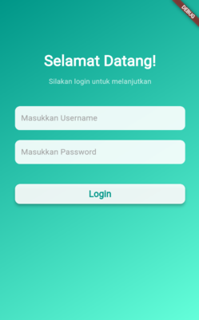
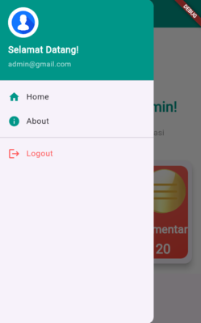
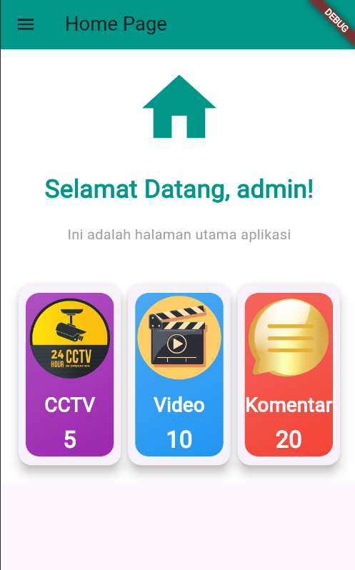
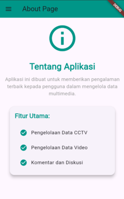
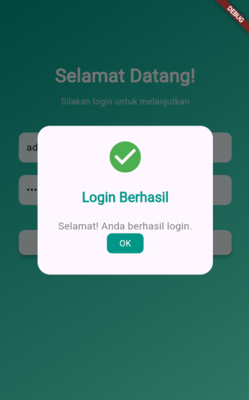
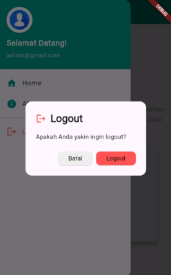

# Tugas Pertemuan 3

Nama : Aura Devany Salsabila Bachtiar

NIM : H1D022015

Shift Baru: Shift C

### Penjelasan Kode
Kode tersebut membangun aplikasi Flutter yang memiliki fitur login, tampilan beranda (home page), tampilan tentang (about page) dengan sidemenu.
1. main.dart
Import: Mengimpor paket yang diperlukan untuk aplikasi, termasuk `material.dart` untuk elemen desain Material dan `login_page.dart` untuk halaman login.

`main` Function: Titik awal aplikasi yang menjalankan widget MyApp.

`MyApp` Class: Widget utama aplikasi yang menggunakan `MaterialApp`, yang mendefinisikan judul aplikasi dan halaman awal (`LoginPage`).

2. login_page.dart
Import: Mengimpor  `material.dart` untuk widget UI, `home_page.dart` untuk navigasi ke halaman utama, dan `shared_preferences.dart` untuk menyimpan data secara lokal.

`LoginPage` Class: Widget yang menampilkan halaman login dengan input untuk username dan password.

`_LoginPageState` Class: Menangani status halaman login, termasuk kontrol untuk input dan logika login.

`_saveUsername` Method: Menyimpan username ke `SharedPreferences` setelah login berhasil.

`_showDialog` Method: Menampilkan dialog untuk memberi tahu pengguna apakah login berhasil atau gagal.

`_buildInputField` Method: Membuat widget input untuk username dan password.

`build` Method: Menggambarkan antarmuka halaman login, termasuk latar belakang, teks sambutan, dan tombol login.
3. side_menu.dart
Import: Mengimpor `material.dart` untuk elemen UI dan halaman lain yang diperlukan untuk navigasi.

`Sidemenu` Class: Widget yang menampilkan menu samping dengan daftar item navigasi.

`build` Method: Menggambarkan drawer yang berisi header dan daftar item navigasi (Home, About, Logout).

4. home_page.dart

Import: Mengimpor `material.dart` dan `side_menu.dart` untuk menampilkan menu samping.

`HomePage` Class: Widget untuk halaman utama setelah pengguna login.

`_HomePageState` Class: Menangani status halaman utama, memuat nama pengguna dari `SharedPreferences`.

`void_loadUsername` Method: Memuat username yang disimpan dan mengupdate UI.

`build` Method: Menggambarkan antarmuka halaman utama dengan judul, pesan selamat datang, dan menu samping.
5. about_page.dart
Import: Mengimpor `material.dart` dan `side_menu.dart` untuk menampilkan antarmuka dan sidemenu.

`AboutPage` Class: Widget stateless untuk halaman tentang aplikasi, yang mencakup informasi penting tentang fungsionalitas aplikasi.

`build` Method: Menggambarkan antarmuka halaman dengan `AppBar` yang memiliki judul "About Page", ikon informasi, dan teks yang menjelaskan tujuan aplikasi.

Body: Menggunakan `SingleChildScrollView` untuk memastikan konten dapat digulir jika diperlukan, dengan padding dan jarak antar elemen agar terlihat rapi.

Fitur Utama: Menampilkan daftar fitur utama aplikasi dengan ikon centang untuk memperjelas setiap fitur yang ditawarkan.

Drawer: Menyediakan menu samping menggunakan widget `Sidemenu`.

4. side_menu.dart

Import: Mengimpor `material.dart` untuk elemen UI dan halaman lain yang diperlukan untuk navigasi.

`Sidemenu` Class: Widget yang menampilkan menu samping dengan daftar item navigasi.

`build` Method: Menggambarkan drawer yang berisi header dan daftar item navigasi (Home, About, Logout).
5. 

6. 

## Screenshot

